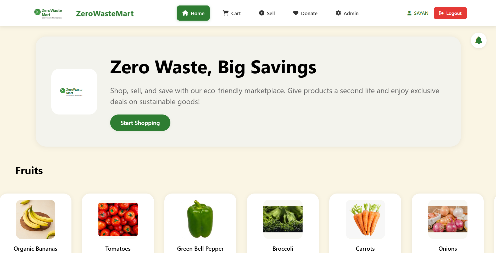

# ZeroWasteMart-AmazingWebsite

# 🌍 ZeroWasteMart — Eco-Friendly Marketplace

**ZeroWasteMart** is an eco-friendly e-commerce web application designed to promote **sustainable shopping**.  
Users can **shop, sell, and donate** items while reducing waste and encouraging product reuse.

---

## 🚀 Features

### 🛒 User Interface
- 🌿 **Eco-Friendly Marketplace** — Buy and sell sustainable products easily.  
- 🔍 **Category-Based Browsing** — Browse fresh produce, groceries, and more.  
- 💰 **Smart Shopping** — Find great deals on reused or surplus goods.  
- ❤️ **Donate Items** — Give away items you no longer need.  
- 🔔 **Notification System** — Stay updated with offers and product expiry alerts.  

### ⚙️ Admin Panel
- 📦 **Product Management** — Add, edit, or delete products with detailed info.  
- ⏰ **Expiry Tracking** — Filter by *Expiring Soon* or *Expired* items.  
- 👥 **User Management** — Manage registered users efficiently.  
- 🧾 **Order Management** — Track and manage all orders in one place.  
- 🔍 **OCR Support (Optional)** — Upload and extract text from images to auto-fill product data.  

---

## 🧠 Tech Stack

| Layer | Technologies Used |
|-------|--------------------|
| **Frontend** | HTML, CSS, JavaScript, React.js / Vue.js (depending on your setup) |
| **Backend** | Node.js / Express.js / FastAPI (select your actual backend) |
| **Database** | MySQL / SQLite |
| **Authentication** | JWT / Session-based Auth |
| **Styling** | Tailwind CSS / Bootstrap |
| **Other Tools** | OCR, File Upload, RESTful APIs |

---

## 📸 Screenshots

### 🏬 Customer View
The main storefront where users can browse eco-friendly goods and start shopping.

### 🧑‍💼 Admin Panel
Powerful admin dashboard for managing products, users, and orders.

---

## 📊 Admin Features Demo

| Action | Description |
|--------|--------------|
| ✏️ **Edit Product** | Update product details such as price, stock, and expiry date. |
| ❌ **Delete Product** | Remove expired or unavailable items. |
| 🕒 **Expiry Filter** | Quickly identify items that are nearing expiry. |
| ➕ **Add New Product** | Add new items with full metadata (name, brand, stock, price, expiry). |

---

## 🌱 Sustainability Mission
ZeroWasteMart helps minimize environmental impact by:
- Promoting product reuse and donation.
- Reducing food waste through expiry management.
- Encouraging affordable and sustainable consumption.

---

## 🧩 Folder Structure (Example)

ZeroWasteMart/
├── 📁 frontend/
│   ├── 📁 public/
│   │   ├── index.html
│   │   └── favicon.ico
│   ├── 📁 src/
│   │   ├── 📁 components/
│   │   │   ├── Navbar.jsx
│   │   │   ├── ProductCard.jsx
│   │   │   ├── Footer.jsx
│   │   │   └── NotificationBell.jsx
│   │   ├── 📁 pages/
│   │   │   ├── Home.jsx
│   │   │   ├── Cart.jsx
│   │   │   ├── Donate.jsx
│   │   │   ├── AdminPanel.jsx
│   │   │   └── Login.jsx
│   │   ├── 📁 assets/
│   │   │   ├── logo.png
│   │   │   ├── screenshot-home.png
│   │   │   └── screenshot-admin.png
│   │   ├── App.jsx
│   │   ├── main.jsx
│   │   └── styles.css
│   ├── package.json
│   └── vite.config.js
│
├── 📁 backend/
│   ├── 📁 routes/
│   │   ├── productRoutes.js
│   │   ├── userRoutes.js
│   │   ├── orderRoutes.js
│   │   └── ocrRoutes.js
│   ├── 📁 controllers/
│   │   ├── productController.js
│   │   ├── userController.js
│   │   ├── orderController.js
│   │   └── ocrController.js
│   ├── 📁 models/
│   │   ├── Product.js
│   │   ├── User.js
│   │   └── Order.js
│   ├── 📁 middleware/
│   │   ├── authMiddleware.js
│   │   └── errorHandler.js
│   ├── 📁 config/
│   │   └── db.js
│   ├── server.js
│   ├── package.json
│   └── .env
│
├── 📁 database/
│   ├── zerowaste.db (or MongoDB Atlas connection)
│   └── seedData.js
│
├── 📁 docs/
│   ├── flowchart.png
│   └── README-assets.md
│
├── 📁 assets/
│   ├── screenshot-home.png
│   ├── screenshot-admin.png
│   └── logo.png
│
├── README.md
├── LICENSE
└── .gitignore
